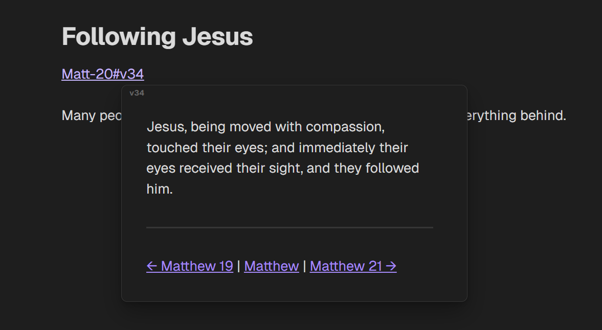

import { YouTube } from 'astro-embed';

I've always been a bit torn about note taking. I am extremely forgetful, so it's basically a necessity for me to write things down, but I've been struggling to find a tool that works for me.

Notes have basically been loose reminders on what I may need to do or little scribbles of thoughts that I want to finish later. Fleshing out a knowledgebase or "digial brain" has never really been a priority for me.
Because of that, I've always stuck to the simpler kind of note taking apps. My go-to for a long while was [Simplenote](https://simplenote.com/). I really liked it because it was, well, *simple*. 

It was a big plus for me that Simplenote allowed me to write my notes in Markdown, structuring my thoughts using `#` for headings, `_` (or `*`) to _italicize_ text and `**` around words to bold them.

It being owned by Automattic, a relatively well-known and trustworthy (at that time) company, and the fact that Simplenote is [open source](https://github.com/Automattic/simplenote-electron) made my decision for it easy.

I used it for a long while, taking advantage of the publishing feature to either share notes using a [simp.ly](http://simp.ly/p/w6569C) link to send drafts of notes to my friends or to directly publish to my Wordpress blog using Jetpack.

My one gripe with Simplenote was its lack of image attachments. I like to include images in my notes to reference later, or in the case of drafting a blog post to just have them ready without having to search them up again when I go and publish it.

So I switched to something different. 

## Searching for a notes app
I've tried a lot of notes apps over the years. Notesnook, Standard Notes, Evernote (that's actually the first notes app i've used), Joplin, Nextcloud Notes, Notion, OneNote, Google Keep and probably a bunch of others that I've forgot.

### Google Keep and OneNote
Up until recently, I've been using Google Keep and Onenote in tandem - and I'm still using OneNote for school.

I really like Onenote's handwriting capabilities - both for taking notes during classes as well as during my bible studies.

The thing that deters me from using Onenote for all of my notes is the mobile app. It's slow, clunky and just doesn't work well for handwritten notes. 

<YouTube id="TjdERTkRoGM" title="Onenote being whacky" />

So I've decided that I'm gonna use Google Keep for my day-to-day note taking - thoughts I wanna write down, reminders, etc. - and OneNote for my bible studies, since marking things and scribbling over notes is something I do. 

Example of my *undoubtedly very beautiful*™ handwriting in Onenote:

I've lived like that for a bit, I've gotten through Proverbs and Psalms and halfway through Matthew, creating sections for each of them in my *Quiet Time* notebook.

That workflow worked well for me for a while, but over the past few days I've noticed something: My *digital dementia* wasn't fixed. I would like to remember what I've read. I would like to be able to search for it and accumulate knowledge and thoughts in a usable format.

Onenote made it easy for me to jot down thoughts, but then they existed without being useful to me. I was still the same forgetful guy with my *undoubtedly very beautiful*™ handwriting that made it hard for Onenote's [OCR](https://en.wikipedia.org/wiki/Optical_character_recognition) to index it.

Besides all of that, Onenote being owned by Microsoft, being unencrypted and only feasably exportable into either a pdf file or a proprietary format always bugged me. It's the same story with Google Keep, while it is easier to export all your notes, best you've gonna get is a bunch of json files.

## Fixing my problems with note taking
Sorry, I lied to you. I've actually purposefully omitted two apps in my list of previously used note taking apps. [Notable](https://notable.md) and [Obsidian](https://obsidian.md).

### Notable
I've used Notable in conjunction with [GitJournal](https://gitjournal.io/) before, but it never really worked for me because I had to manually run ``git pull`` to download changes when I've edited my notes on my phone and ``git add . && git commit -m "updated my notes (again)" && git push -u origin main`` to upload my changes to Github.

In addition to that, development on both Notable and GitJournal has slowed, [it seems](https://github.com/GitJournal/GitJournal/releases/tag/v1.80.0).

### Obsidian
I've heard of Obsidian before and it gets recommended as a Notion alternative constantly. I've used Notion before so I gave Obsidian a try. I didn't like it, so I stopped using it.

Obsidian has a unique approach to note taking. Your notes are simple markdown files and you are left to organize them yourself.

Obsidian builds on the workflow of connected thinking. It uses links between content to build a knowledge graph that shows connections between thoughts and different topics - *automatically* organizing your notes into a digital brain for you.

That system always seemed too complicated for me. Having to maintain my digital brain seemed like work for me, and if it's work for me I want to get paid for it. I unfortunately **do not** get paid for taking notes. 😔

I still had my bible study note taking problem though.

I'm using Obsidian again. That was quick.

Browsing the web, I came across the [Bible Study in Obsidian Kit](https://forum.obsidian.md/t/bible-study-in-obsidian-kit-including-the-bible-in-markdown/12503) by [selfire1](https://joschua.io/about). Thanks Josh.
It's using the backlink system of Obsidian to annotate scripture and to connect ideas to each other.

I have the entire bible in my Obsidian vault as markdown files, and I can mention chapters and verses in my notes using ``[[backlinks]]`. If I am currently reading Matthew 20 and want to write down my thought about Following Jesus, I can create a new note and use the backlinks to link my thought to the exact scripture I just read.

With the CSS tweaks in the kit I can just hover over the link and get an instant preview of what verse I was referencing later:

And I can easily come back to the concept of *Following Jesus* and what it means later, when other scriptures are mentioning it again.

That's not the only way I can work with scripture in Obsidian though. It does heavily push the second brain way of working, but I can just as well create dated files where I write down all of my thoughts on the parts of scripture I've read on thaz particular day.

The kit comes with the World English Bible as markdown files because the WEB allows for redistribution of the bible text, but if you have a different bible translation you might want to use, there is this tool - also made by Joshua - to download a bible translation from BibleGateway and convert it into usable markdown files: https://github.com/selfire1/BibleGateway-to-Obsidian

### Syncing my notes
One major requirement for a notes app for me is it's mobile support.

Obsidian works on mobile - the app isn't *truly* native, but it's still reasonably fast and it works well.

As far as keeping my notes in sync, Obsidian has a end-to-end encrypted sync offering directly integrated into the app.

I would've gone for the Standard tier for 4 bucks, but it only allows me to sync one vault. I like to keep my day-to-day notes and my bible study notes seperate, so I would need to sync two vaults, which isn't worth the 8 bucks for me right now.

For my sync solution I went with [Syncthing](https://syncthing.net). It's a peer-to-peer file sync service that allows me to sync as many files as I want to from my PC to my phone. It's end-to-end encrypted and works well when all of the devices I want to keep in sync are on the same network and when they are not. (In that case, Syncthing is using relays to forward the data end-to-end encrypted to my other device(es))

TL;DR: I'm using Obsidian for my day-to-day and my bible study notes now. The [Bible study in Obsidian Kit](https://forum.obsidian.md/t/bible-study-in-obsidian-kit-including-the-bible-in-markdown/12503) is definitely worth checking out. Thanks [Josh](https://joschua.io/)!